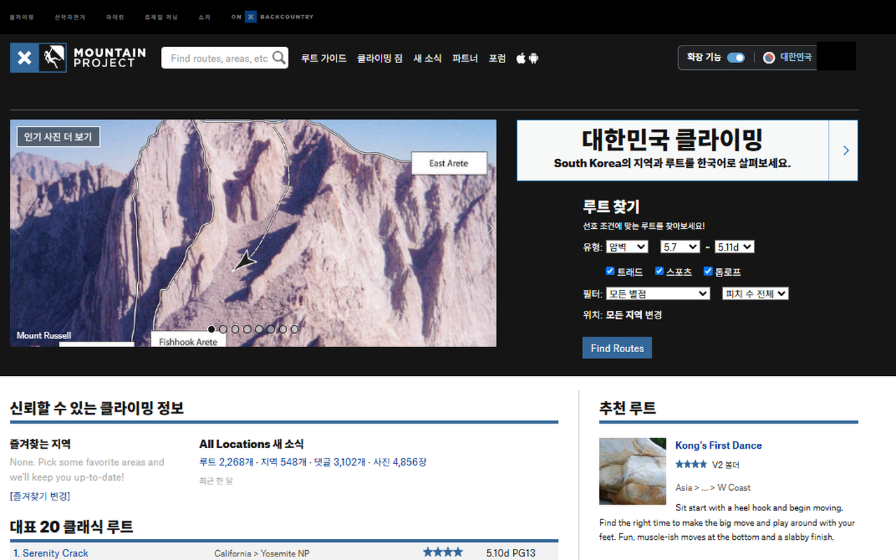

# Mountain Project Korea (비공식)

Mountain Project를 한국어로 읽고 더 편리하게 탐색하도록 돕는 브라우저 확장 프로그램입니다.

한국 사용자의 접근성과 사용성을 높여 더 많은 한국 클라이머가 Mountain Project에 정착하고 활발히 참여하도록 돕습니다. 한국 클라이머의 해외 등반 준비를 지원하고, 한국 사용자들이 공유하는 암장·루트 정보와 등반 경험이 해외 클라이머의 한국 등반에도 도움이 되도록 전 세계 클라이밍 커뮤니티의 지식과 교류에 기여하는 것이 목표입니다.

> An unofficial browser extension that helps Korean climbers read and explore Mountain Project, participate in the community, and share climbing knowledge across borders.

## 출시 현황

**첫 배포 버전 `0.1.0`이 Chrome 웹 스토어에 출시되었습니다.**

[Chrome 웹 스토어에서 설치](https://chromewebstore.google.com/detail/mountain-project-korea-%EB%B9%84%EA%B3%B5/ijgghnbmgbapfckfnkcapbkbbobjochh)

첫 버전 완성을 출발점으로, 실제 사용자의 피드백과 Mountain Project의 변화에 맞춰 오류 수정, 번역 품질 개선, 탐색 기능 확장 등 유지보수와 추가 개발을 계속합니다.

- 출시 대상: 데스크톱 Chrome
- 상태 확인일: 2026년 9월 30일 — 게시자 승인 확인 및 공개 스토어 페이지 확인
- [출시 현황과 다음 단계](docs/release-status.md) · [버전 변경 내역](CHANGELOG.md)

Mountain Project 또는 onX의 공식 제품이 아니며, 공식 제휴나 승인을 의미하지 않습니다.

## 주요 기능

| 기능 | 설명 |
| --- | --- |
| 한국어 UI | 내비게이션, 검색, 기여 폼 등 지원 화면의 고정 문구를 한국어로 표시합니다. |
| 본문·댓글 번역 | 지원되는 지역·루트·사진·커뮤니티 페이지의 내용을 Chrome 내장 번역 기능으로 기기 내에서 번역합니다. |
| 원문 확인·재번역 | 지원 본문에서 원문을 확인하고 다시 번역할 수 있으며, 번역에 실패하면 원문을 유지합니다. |
| 한국·해외 지역 탐색 | 대한민국 바로가기와 한국 지역 목록 개선, 아시아·유럽 등 지역 디렉터리를 제공합니다. 등록 수는 요청할 때 조회합니다. |
| 지도·루트 통계 | 지역 지도와 루트 통계를 페이지에서 확인하고, 목록과 사이드바를 편리하게 탐색합니다. |
| 기능 ON/OFF | 사이트 상단과 확장 팝업에서 기능을 켜고 끌 수 있습니다. 설정은 현재 브라우저에 저장합니다. |



[지역 지도 화면](design/store-assets/screenshot-korea-map-1280x800.png) · [루트 상세 화면](design/store-assets/screenshot-route-detail-1280x800.png) · [페이지별 지원 범위](docs/development.md#페이지-지원-매트릭스)

## 설치 및 사용

[Chrome 웹 스토어에서 설치](https://chromewebstore.google.com/detail/mountain-project-korea-%EB%B9%84%EA%B3%B5/ijgghnbmgbapfckfnkcapbkbbobjochh) 페이지에서 **Chrome에 추가**를 선택하세요. 설치 후 Mountain Project 페이지를 새로고침하면 사용할 수 있습니다.

### 소스로 직접 설치하기

개발하거나 직접 빌드하려면 아래 방법을 사용합니다.

아래 초기 설정·온보딩은 현재 소스의 미출시 변경입니다. 공개된 `0.1.0`의 기본 ON 동작과 다르며, 로컬 패키지 버전은 아직 `0.1.0`입니다.

Node.js와 npm이 필요합니다. 개발 기준 Node.js 버전은 `22.23.2`입니다.

```bash
git clone https://github.com/jeongjong10/mountain-project-korea-extension.git
cd mountain-project-korea-extension
npm ci
npm run build
```

1. Chrome에서 `chrome://extensions`를 열고 **개발자 모드**를 켭니다.
2. **압축해제된 확장 프로그램을 로드합니다**에서 `.output/chrome-mv3` 폴더를 선택합니다.
3. [Mountain Project](https://www.mountainproject.com/)를 열거나 기존 페이지를 새로고침합니다.
4. 저장된 설정이 없으면 **OFF**로 시작하며, 지원되는 상단 스위치가 있는 페이지에서 주변을 어둡게 하고 **확장 기능** 스위치를 강조합니다. 해당 스위치를 켜면 기능을 활성화하며, 메인·본문 번역 지원 페이지에서는 번역 준비도 시작합니다. 이후 상단 또는 확장 팝업에서 켜고 끕니다.

첫 실행 여부는 설치 시점이 아니라 저장소의 `enabled` 키 유무로 판단합니다. 저장된 ON/OFF는 유지하지만, 이전에 설치했어도 설정을 저장한 적이 없거나 키를 삭제했다면 OFF와 안내가 적용됩니다.

스위치 ON과 설정 저장 성공은 Chrome 번역 모델 준비 완료를 뜻하지 않습니다. 안내는 설정 저장이 반영되면 사라지며, 본문은 엔진이 준비되는 대로 자동 번역합니다. 별도의 `번역 준비 시작` 버튼은 없습니다. 저장된 ON으로 진입하거나 팝업에서 켠 경우에는 본문 페이지의 첫 일반 클릭·키 입력이 추가로 필요할 수 있습니다. 내장 번역 API를 사용할 수 없는 환경에서는 본문 번역이 제공되지 않습니다. OFF로 바꾸면 적용한 페이지 기능을 중단·복원하며, 다시 켤 수 있도록 상단 스위치와 대한민국 링크는 남습니다.

## 지원 범위와 참고 사항

- 첫 출시는 데스크톱 Chrome을 대상으로 합니다. Firefox와 모바일·Safari 등 다른 환경의 지원은 개발·검증 단계이며 Chrome과 동일한 기능을 보장하지 않습니다.
- 페이지 구조에 따라 기능 적용 범위가 달라집니다. Mountain Project의 모든 페이지와 모든 변형 화면을 지원하는 것은 아닙니다.
- 기계 번역에는 오류가 있을 수 있습니다. 접근·하강·장비 등 등반 판단에 필요한 정보는 원문과 함께 확인하세요.
- 기여 화면의 고정 안내와 UI를 한국어로 표시하며, 사용자가 작성하는 입력값과 제출 데이터는 보존합니다.

## 권한 및 개인정보

- `storage`: 확장 기능의 ON/OFF 설정을 `storage.local`에 저장합니다.
- 사이트 접근: `https://mountainproject.com/*`와 `https://www.mountainproject.com/*`에서 주소·텍스트·화면 구조를 읽어 번역과 탐색 기능에 사용합니다. 표시된 사용자명이나 게시물의 정보가 처리 대상에 포함될 수 있습니다.
- 본문 번역은 Chrome 내장 Translator API를 사용합니다. 원문·번역 결과는 페이지 메모리에 임시 보관하며, 개발자 서버로 본문이나 사용 기록을 전송하는 기능은 없습니다.
- 지도·통계는 Mountain Project 웹페이지를 불러옵니다. 이 요청에는 IP 주소와 브라우저 설정에 따른 사이트 쿠키가 동반될 수 있습니다. 지역 등록 수는 버튼을 누를 때 공개 페이지를 조회합니다.

[개인정보처리방침](https://mountain-project-korea-privacy.jeongjongyeol.chatgpt.site/)

프로젝트가 지향하는 정보 축적은 사용자가 Mountain Project의 기존 기능으로 직접 기여하는 것을 뜻합니다. 별도의 원본 콘텐츠 데이터베이스를 구축하는 서비스가 아닙니다.

## 지속적인 개선과 참여

첫 버전을 바탕으로 다음 작업을 이어갑니다. 우선순위는 실제 사용 피드백과 검증 결과에 따라 조정합니다.

- 사이트 변경 대응과 오류 수정
- 한국어 표현·본문 번역 품질과 원문 보존 개선
- 지역 탐색과 페이지 사용성 개선
- 브라우저·모바일 환경의 호환성 검토 및 단계적 지원 확대

오류와 기능 제안은 [GitHub Issues](https://github.com/jeongjong10/mountain-project-korea-extension/issues)에 남겨주세요. 페이지 URL, 브라우저 버전, 재현 과정과 기대한 동작을 함께 적어 주시면 확인에 도움이 됩니다. 화면이나 로그를 첨부할 때는 개인정보를 가려 주세요.

## 개발 문서

WXT, TypeScript, Vitest, happy-dom을 사용합니다. 설치·실행 명령, 구조, 페이지별 지원 범위와 검증 방법은 별도 문서에서 관리합니다.

- [개발 및 유지보수 안내](docs/development.md)
- [문서 목록](docs/README.md)
- [첫 배포 버전 소스·패키지 검증 기록](docs/release-source-audit-2026-09-29.md)

후속 개발은 [배포 도구 사용 절차](docs/development.md#후속-버전-배포-도구)에 따라 버전별로 변경 내용을 기록하고 검증한 뒤 배포합니다. 스토어에 배포된 버전과 후속 개발 상태는 구분하여 관리합니다.
